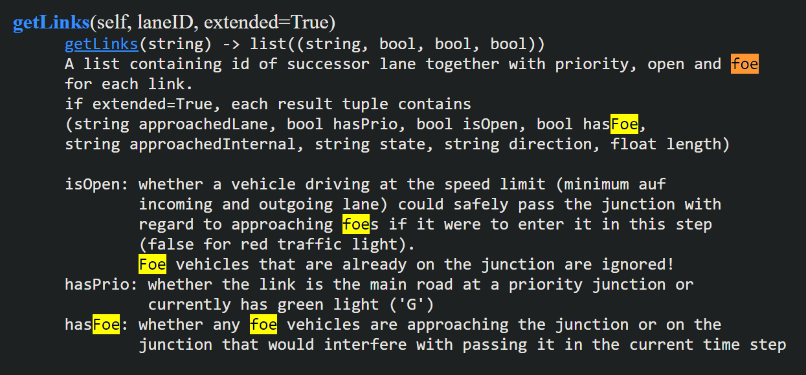
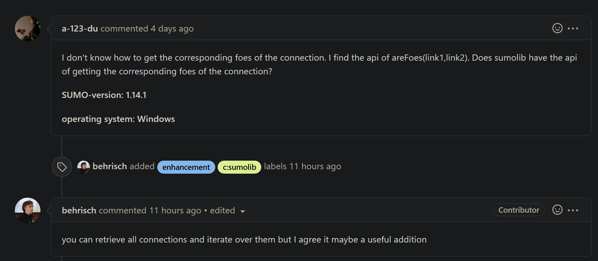
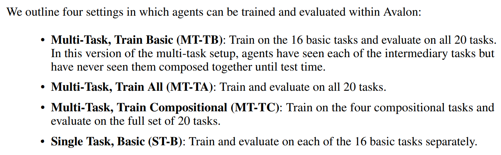

# Phase 1 - Task: Junction - Preparation
## Requirements and Code TODOs
- **JunctionObserver**
  - Start point for every possible target lane
    - Coordinates
    - Prio
    - On route
  - Requires: LaneJunctionGraph
- **Refined road/lane ego observations**
  - Left-right distance to outer road boundaries (also inside junction) -> `road position` + `lane_position`
  - first and second order `road-shape derivative` + `lane-shape derivative`
  - rotation w.r.t road angle
  - road/lane priority
  - distance to junction
  - has connection to edge/lane that is on route
    - maybe also distance until ends
  - Requires: "Outer hull" of route driving segment
  - Optional:
    - Refined subgoal sampling
    - Refined off-route checks (lies inside outer road hull)
- **RoadLaneJunctionGraph**
  - EdgeGraph + junction info + connection info
  - Filter out small junctions
    - Junction area or
    - Distance between from edge and to edge
  - Already implemented: lane left-right borders
    - New: road left-right border ("outer hull")
- *Refinement of traffic observations*
  - Include `is-foe`/`has-priority`
- Move to sumolib.net + sumolib.xml + netconvert + SUMO PlainXML
  - Drop scenariogeneration
- **Basic task scenarios**
  - Encode SUMO priority during network creation
  - Switchable junction scenario types 
    - left, right, follow
    - prio -> prio, prio -> non-prio, non-prio -> prio, non-prio -> non-prio
    - Other ideas:
      - Num lane changes to achieve maneuver
      - Difficulty based on number of foe connections
#### Other stuff I stumbled upon
- We can create vType distributions using the Python API (https://github.com/eclipse/sumo/tree/main/tools/sumolib/vehicletype.py)
Links
- https://sumo.dlr.de/docs/Simulation/
  - https://sumo.dlr.de/docs/Simulation/Intersections.html
- https://sumo.dlr.de/docs/Developer/Network_Building_Process.html
- https://sumo.dlr.de/docs/Networks/
- https://sumo.dlr.de/docs/Networks/Export.html
  - Plain Generated when using the option --plain-output-prefix <FILE>, it generates four files containing the nodes, the edges, the connections and the traffic light logics as described in Networks/Building_Networks_from_own_XML-descriptions.
- https://sumo.dlr.de/docs/Networks/PlainXML.html
https://sumo.dlr.de/pydoc/traci._lane.html

------------------------------------------------

# Phase 1 - Do we have a problem?
Driver Dojo, overall, is in good shape. 

We should try now to answer the central question right now, before delving deeper into more advanced development: **Can we produce useful experimental results?**
## *Experiment*
- **Environment:** `Disc-KS-Intersection-*-*-v0`
- **Goal:** Test different road and traffic seed combinations w.r.t expected generalization issues.
### Agents
  - [ ] *-1_1
  - [ ] *-5_1
  - [ ] *-10_1
  - [ ] *-100_1

------------------------------------------------

# Ideas

## Another look on Driving Tasks

### Tasks
1. `Vanilla street`
   - Drive on allowed lanes
2. `Junction/intersection`
   - +- Traffic lights
   - +- Uncontrolled or priority
   1. Right turn
   2. Left turn
   3. Go straight
      - Either follow priority lane or 
3. `Roundabout`
    1. Entry
    2. Drive
    3. Exit
    4. Full
4. `Highway`
    1. Entry
    2. Drive
    3. Exit
    4. Full
5. `Stop and Go`
   1. Drive -> Stop on right side -> Merge
   2. Driving in traffic jam
   3. Parking?

??? We have composite tasks (enumerated driving scenarios) that can be split into sub-tasks/basic tasks ???
- Don't know if this makes sense
- Multi (composite) task testing also makes sense

### Modifiers
- Street network parameters (duh)
- Initial ego state
- Static obstacles
    - **Idea**: If inside radius around static obstacle, street rules can be violated
- Traffic
    - Density
    - Initialization and routing
    - vType distributions ("driving personalities") 
    - Special maneuvers ("outlier behavior") (emergency break, take right-of-way, ...)
    - Regarding `junctions/intersections`:
      - distinction between `uncontrolled/right-before-left` and `prioritized`
      - `traffic light` extra category both with and w.o. traffic

#### Train/Test combs
1. Single-Task, ...
2. ... TODO

## Misc

# Open Questions
- Algo hyper-parameters (tuned towards performance vs. safety vs. generalization)
  - Also: Reward norm and obs norm
- Impact of traffic seeds
- Impact of vType randomization
- Influence of visual vs. numeric observations
  - Can we actually train while co-simulating to Carla
- Influence of action space
- What is the baseline, non-RL performance?
- Which non-RL or ML approaches should we compare with?
- Generalization-focused RL baselines: Which ones?
  - Should include methods targeted towards visual, numeric (or general) observation setting
  - PLR, Paired?

# Code TODOs
- Include external dependencies (like Carla co-simulation, SUMO tools, ...) as git submodule
- Remove unnecessary action space/observation space modifiers which are already facilitated by OpenAI gym wrappers
- Dict space observations + wrapper
  - 1 entry per observer
  - Wrapper accumulates Dict space into 1-d array, n-d array/image/tensor or {'visual': ..., 'numerical'}
- Tianshou + hyperparam opt 

# Interesting papers
## Environment papers
- Avalon: https://openreview.net/pdf?id=TzNuIdrHoU